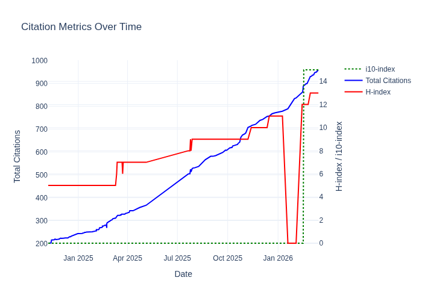
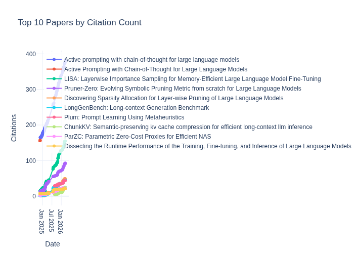

# Citation Statistics

Last updated: 2024-12-20

## Overall Statistics
- Total Citations: 233
- H-index: 5

## Today's Citation Changes 

Total increase: +1 citations

| Paper | Previous | New | Increase |
| ----- | --------- | --- | -------- |
| Active prompting with chain-of-thought for large language models | 171 | 172 | +1 |

## Paper Citations

| Paper | Citations | Year |
| ----- | --------- | ---- |
| Active prompting with chain-of-thought for large language models | 172 | 2023 |
| LISA: Layerwise Importance Sampling for Memory-Efficient Large Language Model Fine-Tuning | 21 | 2024 |
| Pruner-Zero: Evolving Symbolic Pruning Metric from scratch for Large Language Models | 16 | 2024 |
| Plum: Prompt learning using metaheuristic | 9 | 2023 |
| Dissecting the Runtime Performance of the Training, Fine-tuning, and Inference of Large Language Models | 7 | 2023 |
| ParZC: Parametric Zero-Cost Proxies for Efficient NAS | 4 | 2024 |
| LongGenBench: Long-context Generation Benchmark | 2 | 2024 |
| LPZero: Language Model Zero-cost Proxy Search from Zero | 1 | 2024 |
| Discovering Sparsity Allocation for Layer-wise Pruning of Large Language Models | 1 | 2024 |
| Should We Really Edit Language Models? On the Evaluation of Edited Language Models | 0 | 2024 |
| 3D Question Answering for City Scene Understanding | 0 | 2024 |

## Citation History

| Date | Total Citations | H-index |
| ---- | --------------- | ------- |
| 2024-12-20 | 233 | 5 |
| 2024-12-19 | 232 | 5 |
| 2024-12-18 | 229 | 5 |
| 2024-12-17 | 229 | 5 |
| 2024-12-16 | 229 | 5 |
| 2024-12-15 | 228 | 5 |
| 2024-12-14 | 226 | 5 |
| 2024-12-13 | 224 | 5 |
| 2024-12-12 | 224 | 5 |
| 2024-12-11 | 224 | 5 |

## Citation Trends

### Overall Trends

### Individual Paper Trends

*For interactive charts, see [citation_trends.html](citation_trends.html) and [paper_trends.html](paper_trends.html)*