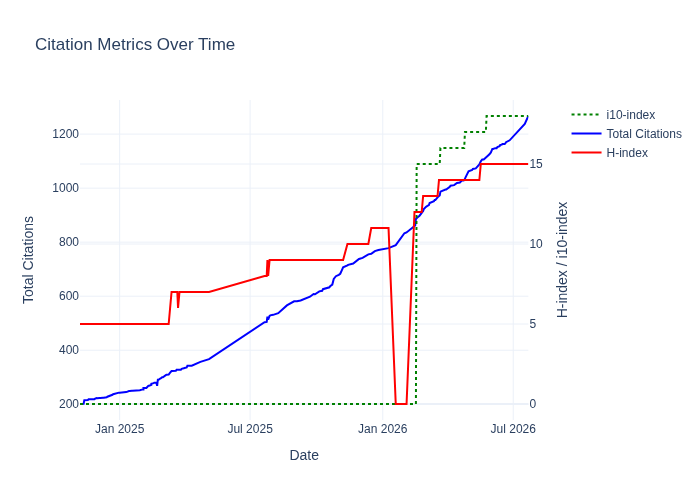
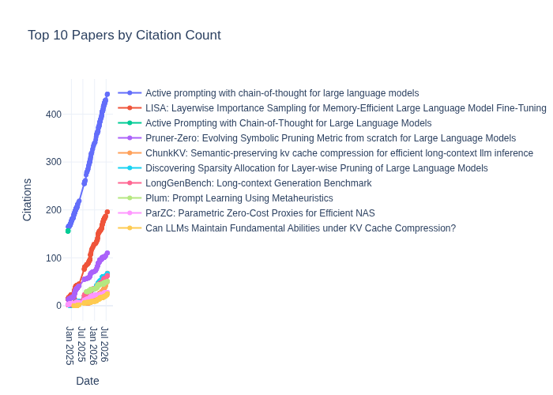

# Citation Statistics

Last updated: 2026-03-20

## Overall Statistics
- Total Citations: 971
- H-index: 14
- i10-index: 15

## Today's Citation Changes 

Total increase: +12 citations

| Paper | Previous | New | Increase |
| ----- | --------- | --- | -------- |
| DiffAdapt: Difficulty-Adaptive Reasoning for Token-Efficient LLM Inference | 2 | 3 | +1 |
| Cafes: A collaborative multi-agent framework for multi-granular multimodal essay scoring | 4 | 5 | +1 |
| EssayJudge: A Multi-Granular Benchmark for Assessing Automated Essay Scoring Capabilities of Multimodal Large Language Models | 12 | 14 | +2 |
| 3D Question Answering for City Scene Understanding | 14 | 15 | +1 |
| Pruner-Zero: Evolving Symbolic Pruning Metric from scratch for Large Language Models | 91 | 93 | +2 |
| Active prompting with chain-of-thought for large language models | 377 | 382 | +5 |

## Paper Citations

| Paper | Citations | Year |
| ----- | --------- | ---- |
| Active prompting with chain-of-thought for large language models | 382 | 2023 |
| LISA: Layerwise Importance Sampling for Memory-Efficient Large Language Model Fine-Tuning | 155 | 2024 |
| Pruner-Zero: Evolving Symbolic Pruning Metric from scratch for Large Language Models | 93 | 2024 |
| Discovering Sparsity Allocation for Layer-wise Pruning of Large Language Models | 49 | 2024 |
| LongGenBench: Long-context Generation Benchmark | 45 | 2024 |
| Plum: Prompt Learning Using Metaheuristics | 44 | 2024 |
| ChunkKV: Semantic-preserving kv cache compression for efficient long-context llm inference | 25 | 2025 |
| ParZC: Parametric Zero-Cost Proxies for Efficient NAS | 22 | 2024 |
| Dissecting the Runtime Performance of the Training, Fine-tuning, and Inference of Large Language Models | 21 | 2023 |
| Should We Really Edit Language Models? On the Evaluation of Edited Language Models | 15 | 2024 |
| 3D Question Answering for City Scene Understanding | 15 | 2024 |
| EssayJudge: A Multi-Granular Benchmark for Assessing Automated Essay Scoring Capabilities of Multimodal Large Language Models | 14 | 2025 |
| Mediator: Memory-efficient llm merging with less parameter conflicts and uncertainty based routing | 14 | 2025 |
| Can LLMs Maintain Fundamental Abilities under KV Cache Compression? | 14 | 2025 |
| Can Compressed LLMs Truly Act? An Empirical Evaluation of Agentic Capabilities in LLM Compression | 12 | 2025 |
| The Lottery LLM Hypothesis, Rethinking What Abilities Should LLM Compression Preserve? | 9 | 2025 |
| LPZero: Language Model Zero-cost Proxy Search from Zero | 8 | 2024 |
| Perovskite-LLM: Knowledge-Enhanced Large Language Models for Perovskite Solar Cell Research | 7 | 2025 |
| OracleKV: Oracle Guidance for Question-Independent KV Cache Compression | 7 | 2025 |
| Cafes: A collaborative multi-agent framework for multi-granular multimodal essay scoring | 5 | 2025 |
| Antkv: Anchor token-aware sub-bit vector quantization for kv cache in large language models | 4 | 2025 |
| DiffAdapt: Difficulty-Adaptive Reasoning for Token-Efficient LLM Inference | 3 | 2026 |
| FlowKV: Enhancing Multi-Turn Conversational Coherence in LLMs via Isolated Key-Value Cache Management | 3 | 2025 |
| Ssr: Speculative parallel scaling reasoning in test-time | 2 | 2025 |
| Reasoning Language Model Inference Serving Unveiled: An Empirical Study | 1 | 2026 |
| Beyond Single Embeddings: Capturing Diverse Targets with Multi-Query Retrieval | 1 | 2025 |
| City-VLM: Towards Multidomain Perception Scene Understanding via Multimodal Incomplete Learning | 1 | 2025 |
| LLM Agent Memory: A Survey from a Unified Representation–Management Perspective | 0 | 2026 |
| Janus-Q: End-to-End Event-Driven Trading via Hierarchical-Gated Reward Modeling | 0 | 2026 |
| From Literature to Lab: Closed-Loop Advancement of Perovskite Solar Cells via Domain Knowledge Guided LLM | 0 | 2026 |
| SONIC: Segmented Optimized Nexus for Information Compression in Key-Value Caching | 0 | 2026 |
| An Improved Autoregressive Evaluation Paradigm for Large Language Models | 0 | 2025 |

## Citation History

| Date | Total Citations | H-index |
| ---- | --------------- | ------- |
| 2026-03-20 | 971 | 14 |
| 2026-03-16 | 959 | 13 |
| 2026-03-14 | 952 | 13 |
| 2026-03-13 | 952 | 13 |
| 2026-03-12 | 949 | 13 |
| 2026-03-09 | 947 | 13 |
| 2026-03-08 | 945 | 13 |
| 2026-03-07 | 937 | 13 |
| 2026-03-05 | 936 | 13 |
| 2026-03-04 | 934 | 13 |

## Citation Trends

### Overall Trends

### Individual Paper Trends

*For interactive charts, see [citation_trends.html](citation_trends.html) and [paper_trends.html](paper_trends.html)*