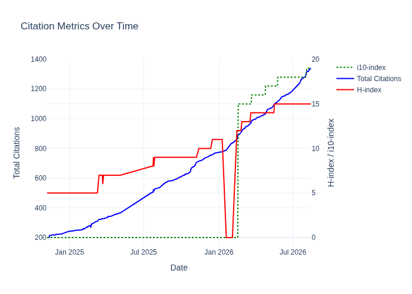
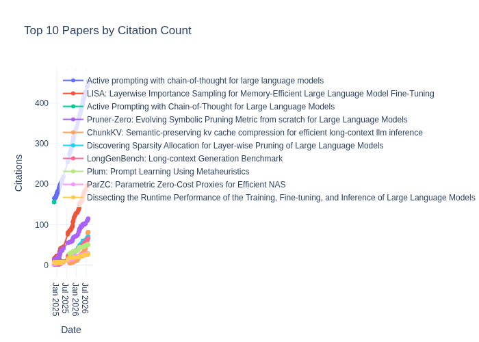

# Citation Statistics

Last updated: 2026-08-04

## Overall Statistics
- Total Citations: 1318
- H-index: 15
- i10-index: 19

## Today's Citation Changes

Total increase: +39 citations

| Paper | Previous | New | Increase |
| ----- | -------- | --- | -------- |
| Active prompting with chain-of-thought for large language models | 443 | 450 | +7 |
| Can Compressed LLMs Truly Act? An Empirical Evaluation of Agentic Capabilities in LLM Compression | 22 | 26 | +4 |
| LongGenBench: Long-context Generation Benchmark | 62 | 66 | +4 |
| Pruner-Zero: Evolving Symbolic Pruning Metric from scratch for Large Language Models | 110 | 114 | +4 |
| The Lottery LLM Hypothesis, Rethinking What Abilities Should LLM Compression Preserve? | 12 | 15 | +3 |
| DiffAdapt: Difficulty-Adaptive Reasoning for Token-Efficient LLM Inference | 6 | 8 | +2 |
| Discovering Sparsity Allocation for Layer-wise Pruning of Large Language Models | 68 | 70 | +2 |
| Dissecting the Runtime Performance of the Training, Fine-tuning, and Inference of Large Language Models | 25 | 27 | +2 |
| FlowKV: Enhancing Multi-Turn Conversational Coherence in LLMs via Isolated Key-Value Cache Management | 6 | 8 | +2 |
| LPZero: Language Model Zero-cost Proxy Search from Zero | 9 | 11 | +2 |
| SONIC: Segmented optimized nexus for information compression in key-value caching | 2 | 4 | +2 |
| 3D Question Answering for City Scene Understanding | 21 | 22 | +1 |
| Can LLMs Maintain Fundamental Abilities under KV Cache Compression? | 25 | 26 | +1 |
| ChunkKV: Semantic-preserving kv cache compression for efficient long-context llm inference | 79 | 80 | +1 |
| LLM Agent Memory: A Survey from a Unified Representation–Management Perspective | 3 | 4 | +1 |
| MDN: Parallelizing Stepwise Momentum for Delta Linear Attention | 0 | 1 | +1 |
| NestedKV: Nested Memory Routing for Long-Context KV Cache Compression | 0 | 1 | +1 |
| ParZC: Parametric Zero-Cost Proxies for Efficient NAS | 28 | 29 | +1 |
| Perovskite-LLM: Knowledge-Enhanced Large Language Models for Perovskite Solar Cell Research | 11 | 12 | +1 |
| Should We Really Edit Language Models? On the Evaluation of Edited Language Models | 21 | 22 | +1 |

## Paper Citations

| Paper | Citations | Year |
| ----- | --------- | ---- |
| Active prompting with chain-of-thought for large language models | 450 | 2023 |
| LISA: Layerwise Importance Sampling for Memory-Efficient Large Language Model Fine-Tuning | 195 | 2024 |
| Pruner-Zero: Evolving Symbolic Pruning Metric from scratch for Large Language Models | 114 | 2024 |
| ChunkKV: Semantic-preserving kv cache compression for efficient long-context llm inference | 80 | 2025 |
| Discovering Sparsity Allocation for Layer-wise Pruning of Large Language Models | 70 | 2024 |
| LongGenBench: Long-context Generation Benchmark | 66 | 2024 |
| Plum: Prompt Learning Using Metaheuristics | 50 | 2024 |
| ParZC: Parametric Zero-Cost Proxies for Efficient NAS | 29 | 2024 |
| Dissecting the Runtime Performance of the Training, Fine-tuning, and Inference of Large Language Models | 27 | 2023 |
| Can Compressed LLMs Truly Act? An Empirical Evaluation of Agentic Capabilities in LLM Compression | 26 | 2025 |
| Can LLMs Maintain Fundamental Abilities under KV Cache Compression? | 26 | 2025 |
| Should We Really Edit Language Models? On the Evaluation of Edited Language Models | 22 | 2024 |
| 3D Question Answering for City Scene Understanding | 22 | 2024 |
| EssayJudge: A Multi-Granular Benchmark for Assessing Automated Essay Scoring Capabilities of Multimodal Large Language Models | 19 | 2025 |
| Mediator: Memory-efficient llm merging with less parameter conflicts and uncertainty based routing | 16 | 2025 |
| The Lottery LLM Hypothesis, Rethinking What Abilities Should LLM Compression Preserve? | 15 | 2025 |
| OracleKV: Oracle Guidance for Question-Independent KV Cache Compression | 13 | 2025 |
| Perovskite-LLM: Knowledge-Enhanced Large Language Models for Perovskite Solar Cell Research | 12 | 2025 |
| LPZero: Language Model Zero-cost Proxy Search from Zero | 11 | 2024 |
| DiffAdapt: Difficulty-Adaptive Reasoning for Token-Efficient LLM Inference | 8 | 2026 |
| FlowKV: Enhancing Multi-Turn Conversational Coherence in LLMs via Isolated Key-Value Cache Management | 8 | 2025 |
| Cafes: A collaborative multi-agent framework for multi-granular multimodal essay scoring | 8 | 2025 |
| Antkv: Anchor token-aware sub-bit vector quantization for kv cache in large language models | 6 | 2025 |
| LLM Agent Memory: A Survey from a Unified Representation–Management Perspective | 4 | 2026 |
| SONIC: Segmented optimized nexus for information compression in key-value caching | 4 | 2026 |
| City-VLM: Towards Multidomain Perception Scene Understanding via Multimodal Incomplete Learning | 4 | 2025 |
| Beyond single embeddings: Capturing diverse targets with multi-query retrieval | 3 | 2025 |
| Ssr: Speculative parallel scaling reasoning in test-time | 3 | 2025 |
| -mem: Efficient Online Memory for Large Language Models | 2 | 2026 |
| Reasoning Language Model Inference Serving Unveiled: An Empirical Study | 2 | 2026 |
| NestedKV: Nested Memory Routing for Long-Context KV Cache Compression | 1 | 2026 |
| MDN: Parallelizing Stepwise Momentum for Delta Linear Attention | 1 | 2026 |
| Janus-Q: End-to-End Event-Driven Trading via Hierarchical-Gated Reward Modeling | 1 | 2026 |
| Introducing Macaron-V1 | 0 | 2026 |
| CoT-Core: Accelerating LLM Evaluation via CoT-Aware Coreset Selection | 0 | 2026 |
| UI4A: A Component-Native Harness for Generative UI | 0 | 2026 |
| LongStraw: Long-Context RL Beyond 2M Tokens under a Fixed GPU Budget | 0 | 2026 |
| Macaron-V1-Preview: 749B MoL Agent Model post-trained from GLM5.1 | 0 | 2026 |
| On the Scaling of PEFT: Towards Million Personal Models of Trillion Parameters | 0 | 2026 |
| MinT: Managed Infrastructure for Training and Serving Millions of LLMs | 0 | 2026 |
| Position: LLM Inference Should Be Evaluated as Energy-to-Token Production | 0 | 2026 |
| An Improved Autoregressive Evaluation Paradigm for Large Language Models | 0 | 2026 |
| From Literature to Lab: Closed-Loop Advancement of Perovskite Solar Cells via Domain Knowledge Guided LLM | 0 | 2026 |
| Enhancing Knowledge Injection with Surrounding Backgrounds in Continual Training LLMs | 0 | N/A |
| Is Privacy Always Prioritized over Learning? Probing LLMs' Value Priority Belief under External Perturbations | 0 | N/A |

## Citation History

| Date | Total Citations | H-index |
| ---- | --------------- | ------- |
| 2026-08-04 | 1318 | 15 |
| 2026-07-31 | 1279 | 15 |
| 2026-07-29 | 1279 | 15 |
| 2026-07-23 | 1267 | 15 |
| 2026-07-22 | 1267 | 15 |
| 2026-07-17 | 1238 | 15 |
| 2026-06-26 | 1177 | 15 |
| 2026-06-21 | 1170 | 15 |
| 2026-06-20 | 1166 | 15 |
| 2026-06-19 | 1163 | 15 |

## Citation Trends

### Interactive Dashboard
[Open citation dashboard](dashboard.html)

### Overall Trends

### Individual Paper Trends

*For interactive charts, see [citation_trends.html](citation_trends.html) and [paper_trends.html](paper_trends.html)*