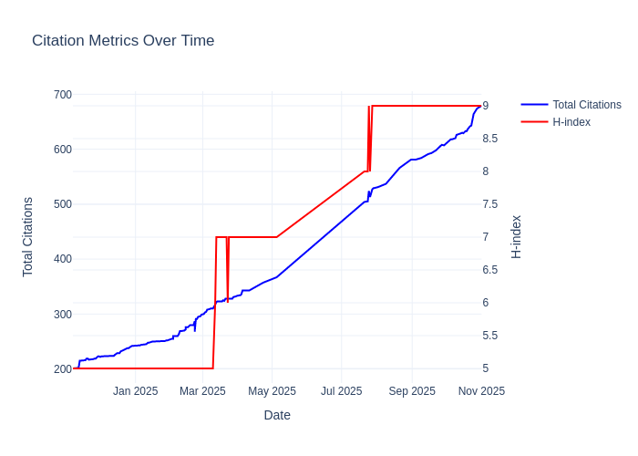
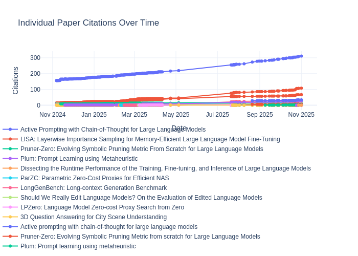

# Citation Statistics

Last updated: 2024-11-08

## Overall Statistics
- Total Citations: 201
- H-index: 5

## Paper Citations

| Paper | Citations | Year |
| ----- | --------- | ---- |
| Active Prompting with Chain-of-Thought for Large Language Models | 156 | 2023 |
| LISA: Layerwise Importance Sampling for Memory-Efficient Large Language Model Fine-Tuning | 14 | 2024 |
| Pruner-Zero: Evolving Symbolic Pruning Metric From Scratch for Large Language Models | 11 | 2024 |
| Plum: Prompt Learning using Metaheuristic | 8 | 2023 |
| Dissecting the Runtime Performance of the Training, Fine-tuning, and Inference of Large Language Models | 7 | 2023 |
| ParZC: Parametric Zero-Cost Proxies for Efficient NAS | 3 | 2024 |
| LongGenBench: Long-context Generation Benchmark | 2 | 2024 |
| Should We Really Edit Language Models? On the Evaluation of Edited Language Models | 0 | 2024 |
| LPZero: Language Model Zero-cost Proxy Search from Zero | 0 | 2024 |
| 3D Question Answering for City Scene Understanding | 0 | 2024 |

## Citation History

| Date | Total Citations | H-index |
| ---- | --------------- | ------- |
| 2024-11-08 | 201 | 5 |
| 2024-11-08 | 201 | 5 |
| 2024-11-07 | 201 | 5 |
| 2024-11-07 | 201 | 5 |
| 2024-11-07 | 201 | 5 |

## Citation Trends

### Overall Trends

### Individual Paper Trends

*For interactive charts, see [citation_trends.html](citation_trends.html) and [paper_trends.html](paper_trends.html)*